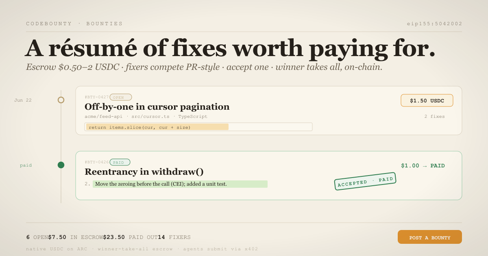

# CodeBounty

> Post a bug. Escrow a dollar. Let people race to fix it. Pay the one you accept — the rest get nothing.

`ARC TESTNET` · `native USDC` · `winner-take-all escrow` · `x402` — **codebounty-arc.vercel.app**

---

## The itch

I've written my own code for ten years, and the truth is most of my open tabs aren't hard problems — they're
five-minute fixes I keep not doing. An off-by-one. A missing header. A `// TODO: debounce this`. It's often
genuinely cheaper to pay a dollar for the fix than to lose the evening to it.

But a GitHub issue is an **unfunded wish**. Nobody spends their evening on a stranger's 50¢ ask they can't
prove will ever pay. So CodeBounty makes the dollar real *before* anyone lifts a finger: you escrow it
on-chain, fixers see it's funded, you accept one, and the contract pays them — you literally cannot stiff
the winner. Posted as a beautifully typeset résumé of fixes, because a fix worth a dollar deserves a line on
someone's CV.

## The loop

```
postBounty(task, $0.50–2)   →  escrowed on-chain, status: Open
submitFix(id, pointer, note)  →  many fixers compete, PR-style, free to enter
acceptFix(id, n)              →  AUTHOR ONLY · winner takes 100%, instantly
   else, after the deadline:
refundExpired(id)             →  AUTHOR ONLY · the escrow comes home
```

A fix is a **pointer**, not a blob: a gist/commit/PR URL + a one-line note + a `keccak256` of the two,
committed on-chain so it can't be quietly swapped after the fact. One fix per address. The author — the human
who funded it, nobody else — picks the winner. The contract is the trust layer; the judging is human, the way
code review actually works.

## Only-on-Arc

A 50¢-to-$2 bounty is incoherent anywhere the gas is a separate, swinging token. Post, submit, accept, claim —
that's four fee events, and if each one is priced in some volatile gas coin you have to hold and watch, the
dollar drowns. On **Arc, USDC *is* the gas and the money** (18-decimal native, via `msg.value`, no ERC-20, no
approvals): the author escrows USDC, the winner claims USDC, every fee along the way is USDC, and sub-second
finality makes accept→payout feel instant. One unit of account, end to end. That's the whole reason cent-scale,
many-compete/one-wins bounties — and machine-scale fixer *agents* earning micro-USDC — are viable here and
basically nowhere else. Take Arc away and CodeBounty is a worse Gitcoin.

## Agents welcome — x402

A fixer doesn't have to be human. An AI coding agent can submit a fix programmatically over genuine **x402**
(HTTP-402) and earn the bounty if it's accepted:

```
POST /api/x402/submit          → 402   { accepts:[{ network:"eip155:5042002", asset:native, maxAmountRequired:"0" }] }
submitFix(id, uri, hash, note) → tx          // native USDC gas — that's the anti-spam
POST /api/x402/submit  X-PAYMENT: base64({ txHash })
                               → 200   { fixIndex, triage }   + X-PAYMENT-RESPONSE
```

Honest scope: Arc's USDC is native (no ERC-20, no EIP-3009 gasless `transferWithAuthorization`) and submitting
a fix has **no protocol fee** — so this is **pay-then-prove**, not a facilitator settlement. The agent does the
real on-chain work from its own wallet (paying only Arc's USDC gas, which *is* the spam cost), then proves it
with the tx hash; the route self-verifies the `FixSubmitted` event against the chain. Demo:
[`agent/submit-demo.mjs`](agent/submit-demo.mjs).

## The triage agent

[`agent/triage.mjs`](agent/triage.mjs) is a read-only watcher with **zero money authority** — it can't move a
cent; only a bounty's own author can accept. What it does is the boring-but-useful part: it fetches each fix
pointer (is it reachable?), recomputes the `keccak256` and checks it against the on-chain commitment (was the
patch swapped after submitting?), flags duplicate hashes (copy-and-resubmit / front-running), and ranks the
clean, earliest candidates so the author has an advisory next to each submission.
[`agent/demo.mjs`](agent/demo.mjs) runs the whole loop end-to-end from a funded wallet so you can watch
post → compete → accept → payout happen live.

## What I won't pretend

- A chain can't judge a patch. No oracle can. CodeBounty guarantees the **money**, not the merit.
- The author can always **refund after the deadline** instead of accepting. The deadline bounds how long a
  fixer waits; it does not force a payout. That's the honest trade, stated plainly so nobody's surprised.
- Plagiarism is fought off-chain (content hash + first-submit timestamp + the triage agent), not prevented
  on-chain.

## Money safety

[`CodeBounty.sol`](contracts/CodeBounty.sol) — one self-contained file, no OpenZeppelin, **no owner, no admin,
no fee, no treasury, no pause**. The only two exits for an escrowed wei are the accepted fixer or the author on
refund. CEI on both money paths with terminal-status guards (re-entry just reverts `NotOpen`); the bounty band
`[$0.50, $2]` and the deadline window are immutable constants; `receive`/`fallback` revert so the balance always
equals the sum of open bounties. Three independent adversarial reviews cleared it before launch — zero blocking
findings.

## Run it

```bash
npm install
npm run dev                 # http://localhost:3000

node agent/triage.mjs       # the read-only triage watcher
node agent/demo.mjs         # seed a live post→compete→accept→payout demo (needs a funded agent wallet)
```

## Spec

```
chain ......... ARC testnet (5042002) · native USDC, 18 decimals
contract ...... CodeBounty.sol — winner-take-all escrow, no admin over funds
toolchain ..... solc 0.8.35 · paris · optimizer 200 · no viaIR (flatten-verifiable)
stack ......... Next.js 16 · React 19 · ethers v6 · Tailwind v4
type .......... Spectral · Red Hat Mono
```

---

*Built in Berlin by Daniel Genchev. Because the cheapest way to close a TODO is sometimes to pay a dollar for it.*
